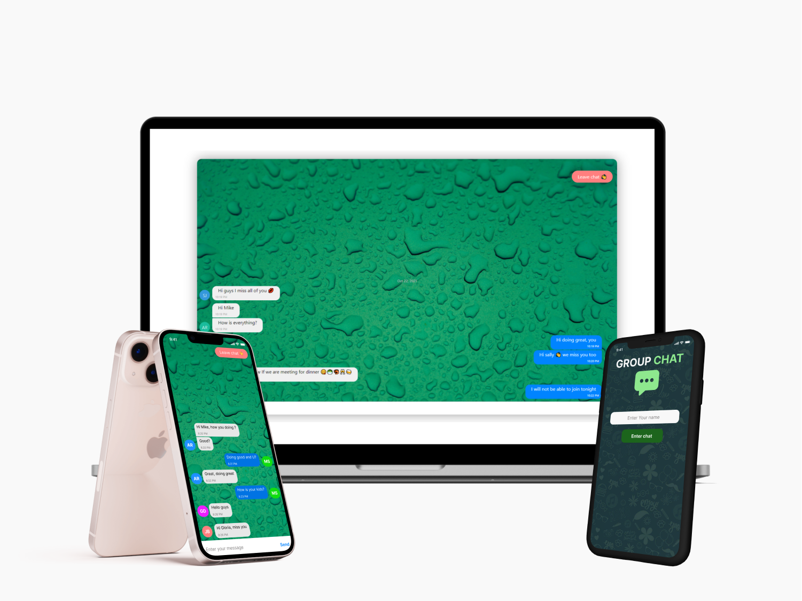

### 1. Description
---
+ Group chat to message your friends and family 
+ The application can run on browser or mobile apps
+ All messages and chats stored in firestore database 

### 2. Technology used 
---
1. <span align="left">Firebase  
</span>
<br/>
2. <span align="left">React Native  
</span>
<br/>
3. <span align="left">Expo  
</span>
<br/>

### 3. Configurations 

Update the **firestore.js** file with your firebase configurations

```Javascript
import firebase from 'firebase/app';
import 'firebase/firestore';

const firebaseConfig = {
//  Your configurations 
};
```

### 4. Features
---
1. Real time Firestore database
2. persist login with [AsyncStorage library](https://reactnative.dev/docs/asyncstorage)
3. Beatiful chat UI using [react-native-gifted-chat library](https://www.npmjs.com/package/react-native-gifted-chat)

### 5. Perview
 
<p align="center">
 
</p>

### 6. Demo
---
The application is live and hosted by expo.
To try the app download expo go from your app store and scan the [App QR code](https://expo.dev/@arezk20/ChatAPP) 
* [Download Expo from App store](https://apps.apple.com/app/apple-store/id982107779)
* [Download Expo from Google Play](https://play.google.com/store/apps/details?id=host.exp.exponent&referrer=www)


